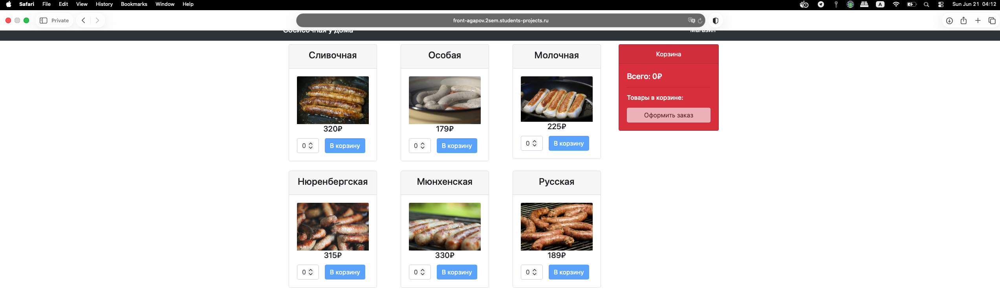
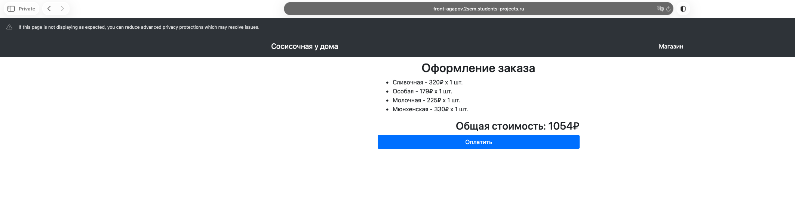
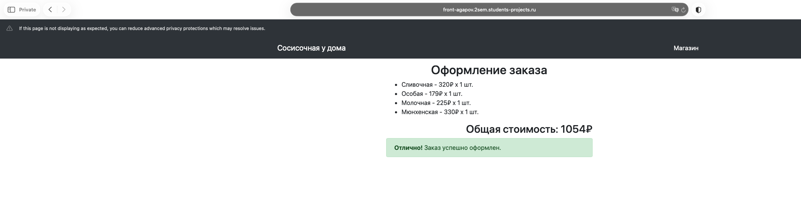
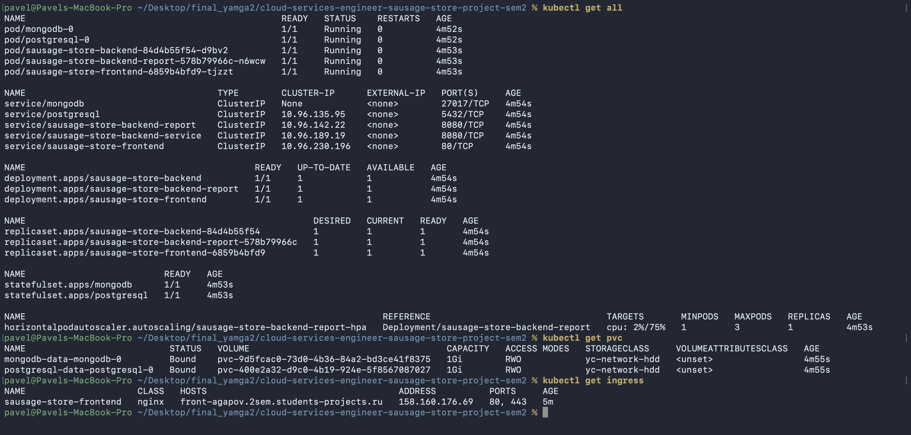

# Финальный проект 2 семестра - Сосисочная

## Архитекту
ра

Приложение состоит из следующих компонентов:

- **frontend** — статический frontend, обслуживаемый через Nginx;
- **backend** — Java Spring Boot;
- **backend-report** — сервис отчётов на Go;
- **PostgreSQL** — основная база данных;
- **MongoDB** — база данных для сервиса отчётов;
- **HashiCorp Vault** — внешнее хранилище секретов для приложения.

Развёртывание выполняется через родительский Helm chart:

```text
sausage-store-chart/
├── charts/
│   ├── frontend/
│   ├── backend/
│   ├── backend-report/
│   └── infra/
```

Chart `infra` отвечает за развёртывание PostgreSQL и MongoDB.

## Контейнеризация

Для каждого компонента приложения подготовлен отдельный Dockerfile:

```text
frontend/Dockerfile
backend/Dockerfile
backend-report/Dockerfile
```

Frontend собирается через multi-stage Dockerfile: сначала выполняется сборка приложения в Node.js, затем результат размещается в Nginx image.

Backend собирается как Spring Boot приложение и запускается в контейнере от непривилегированного пользователя.

Backend-report собирается из исходного кода Go-приложения.

## Базы данных и постоянное хранилище

PostgreSQL и MongoDB развёрнуты в Kubernetes как `StatefulSet`.

Обе базы используют постоянное хранилище через `PersistentVolumeClaim`:

```text
postgresql-data-postgresql-0
mongodb-data-mongodb-0
```

Миграции PostgreSQL выполняются через Flyway. Файлы миграций находятся в директории:

```text
backend/src/main/resources/db/migration/
```

В проекте используются следующие миграции:

```text
V001__create_tables.sql
V002__change_schema.sql
V003__insert_data.sql
V004__create_index.sql
```

Миграции применяются автоматически при запуске backend-приложения.

## Развёртывание через Helm

Приложение разворачивается командой:

```bash
helm upgrade --install sausage-store ./sausage-store-chart
```

Helm chart разворачивает:

- PostgreSQL StatefulSet и Service;
- MongoDB StatefulSet и Service;
- Backend Deployment и Service;
- Backend-report Deployment и Service;
- Frontend Deployment, Service и Ingress;
- HPA для backend-report;
- VPA для backend;
- необходимые ConfigMap и Secret.

Backend использует init containers для ожидания готовности PostgreSQL и MongoDB перед запуском основного контейнера.

Backend-report также ожидает готовности MongoDB перед запуском.

## Ingress и TLS

Frontend опубликован через Kubernetes Ingress:

```text
https://front-agapov.2sem.students-projects.ru
```

TLS настроен с использованием предоставленного wildcard secret:

```text
2sem-students-projects-wildcard-secret
```



Маршрутизация Ingress:

```text
/      -> frontend service
/api   -> backend service
```

## Интеграция с HashiCorp Vault

Я использовал внешнее HashiCorp Vault, развёрнутое на отдельной виртуальной машине в Yandex Cloud:

```text
https://www.agapovlab.ru
```

Vault опубликован через Nginx с TLS-сертификатом GlobalSign DV.

Сам Vault слушает только локальный интерфейс внутри виртуальной машины:

```text
127.0.0.1:8200
```

Backend-приложение аутентифицируется в Vault через AppRole.

В Vault KV v2 хранятся следующие параметры backend-приложения:

```text
spring.datasource.url
spring.datasource.username
spring.datasource.password
spring.data.mongodb.uri
```

Backend не получает параметры подключения к PostgreSQL и MongoDB напрямую через Kubernetes environment variables.

В Kubernetes хранится только AppRole Secret, необходимый для аутентификации backend-приложения в Vault:

```text
sausage-store-vault-approle
```

Сервис backend-report не является Spring-приложением, поэтому его строка подключения к MongoDB передаётся через Kubernetes Secret.

## Автомасштабирование

В проекте используются два механизма автомасштабирования:

- **HPA** для `backend-report`;
- **VPA** для `backend`.

HPA масштабирует backend-report на основе CPU utilization.

VPA используется для backend и формирует рекомендации по ресурсам контейнера.

## CI/CD Pipeline

CI/CD реализован через GitHub Actions.

Pipeline выполняет следующие действия:

1. Собирает Docker images для:
   - backend;
   - backend-report;
   - frontend.
2. Публикует Docker images в DockerHub.
3. Упаковывает Helm chart.
4. Загружает Helm chart package в Nexus.
5. Скачивает Helm chart из Nexus.
6. Выполняет развёртывание в Kubernetes через `helm upgrade --install`.

Для работы pipeline используются GitHub Actions secrets:

```text
DOCKER_USER
DOCKER_PASSWORD
NEXUS_HELM_REPO
NEXUS_HELM_REPO_USER
NEXUS_HELM_REPO_PASSWORD
KUBE_CONFIG_B64
VAULT_ROLE_ID
VAULT_SECRET_ID
```

Перед развёртыванием pipeline создаёт или обновляет Kubernetes Secret, необходимый для AppRole-аутентификации backend-приложения в Vault.

## Проверка развёртывания

Основные команды для проверки состояния приложения:

```bash
kubectl get pods
kubectl get pvc
kubectl get svc
kubectl get ingress
kubectl get hpa
kubectl get vpa
```

Проверка backend API:

```bash
curl -i https://front-agapov.2sem.students-projects.ru/api/products
```

Проверка Helm chart перед развёртыванием:

```bash
helm lint ./sausage-store-chart
helm template sausage-store ./sausage-store-chart
```

## Результат

В рамках проекта реализовано:
- контейнеризация всех компонентов приложения;
- развёртывание через Helm;
- PostgreSQL и MongoDB с постоянным хранилищем;
- миграции PostgreSQL через Flyway;
- Ingress с TLS;
- HPA и VPA;
- публикация Docker images в DockerHub;
- публикация Helm chart в Nexus;
- CI/CD через GitHub Actions;
- внешняя интеграция с HashiCorp Vault для хранения секретов backend-приложения.